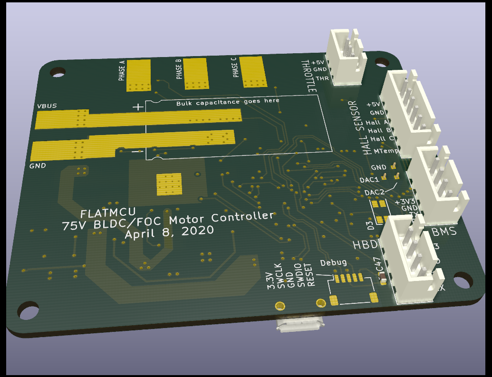

# flatmcu
Hardware design for the flatmcu - an STM32G4 based BLDC / FOC motor controller.

## Features
All schematic and layout was created with KiCad EDA (https://kicad.org).

The controller is based on the STM32G473CB microcontroller from ST Microelectronics. It contains an ARM Cortex-M4 core at up to 170MHz. The three-phase bridge driver is the TI DRV8353RS, which also contains shunt resistor current sensors and a 95V buck regulator.

The MOSFETs in the three-phase bridge (Toshiba TPW4R50ANH) are dual-side cooling. There's a large metal pad on top of them. A heatsink should be attached there. The opposite side of the board is intended for soldering on the large battery and phase wires.

## Schematic
### Main

### Microcontroller

### Three-phase bridge

